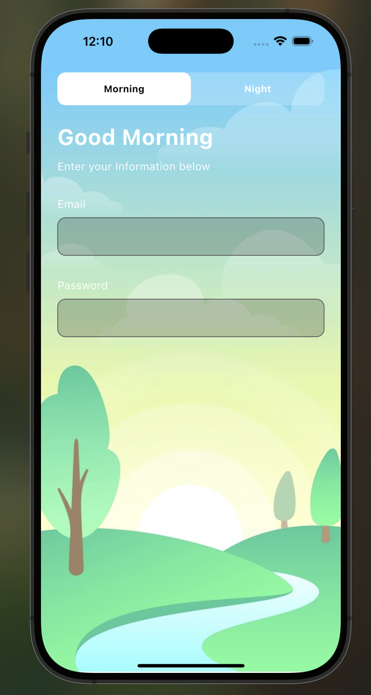
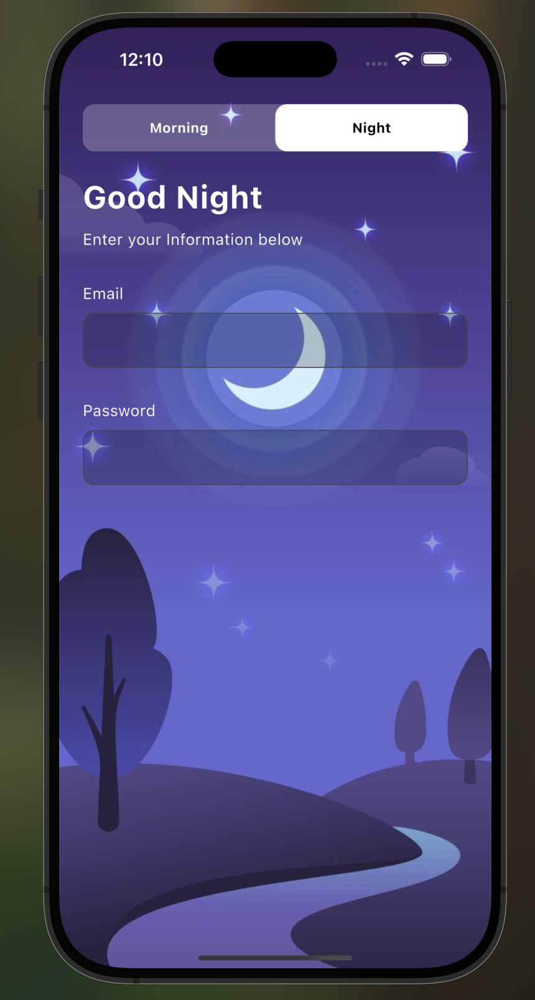

# Morning Night Login

## Overview

Morning Night Login is a Flutter application that presents a beautifully themed login screen with dynamic visuals for both morning and night. It features a toggle that changes the background and greeting based on the selected mode, offering a pleasant and engaging user experience.

## Features

- **Theme Toggle**: Switch between Morning and Night modes with a single tap.
- **Dynamic Background**: Displays a visually distinct image for each mode, either morning or night.
- **Personalized Greeting**: Updates the greeting message based on the selected theme.
- **Minimal UI**: A clean and focused layout with email and password input fields.

## Screenshots

Here's how the login screen looks in both modes:

 

<table>
  <tr>
    <td align="center" style="padding: 20px;">
      <h3>Morning Mode</h3>
      
    </td>
    <td align="center" style="padding: 20px;">
      <h3>Night Mode</h3>
      
    </td>
  </tr>
</table>

